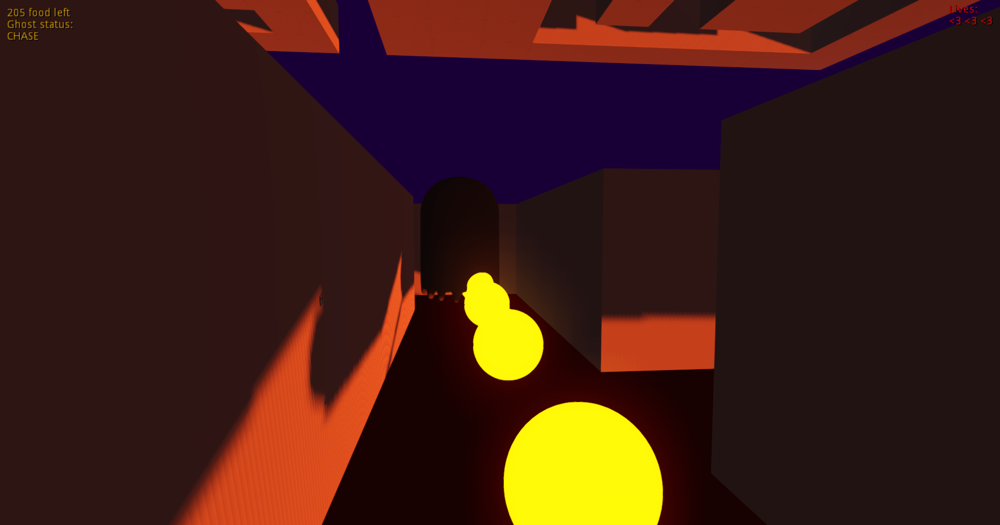
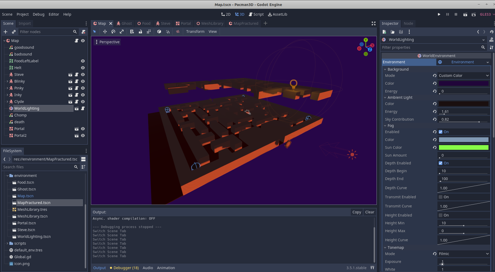

# PACMAN3D
#
### About
3D version of Pac-Man video game made in Godot game-engine as a part of a university course.

#### How to play
- Movement - `W,A,S,D - move` and `Mouse - look`
- You have `3 lives` as indicated by 3 hears in upper right corner
- Game consists of two phases - `CHASE` (get touched by ghosts -> die) and `FRIGHTENED` (touch ghosts -> gain a life)
- `Eat` all the food before you lose all three lives

#
### Installation
Git clone this repo and open it with [Godot](:https://godotengine.org/) game-engine.
...or just download a executable for Linux or Windows from [releases](https://github.com/thelcrysis/pacman3d/pull/10).
#
### [Gameplay](https://youtu.be/X69-Z1ujjNk) and screenshots

